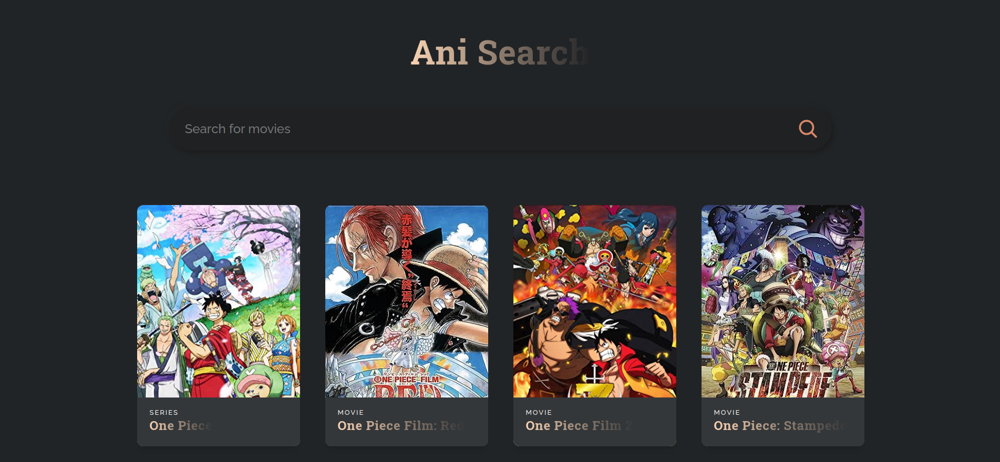

# Ani Search 

#### The **`Ani Search`** React app allows users to search for movies using the OMDB API.
#### Users can enter a movie title in the search bar, triggering a live search that populates a grid of movie cards with relevant information.
#### It provides a user-friendly interface for exploring movie details and utilizes asynchronous fetching for seamless updates.

